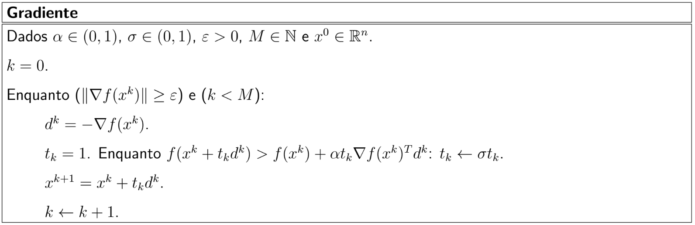
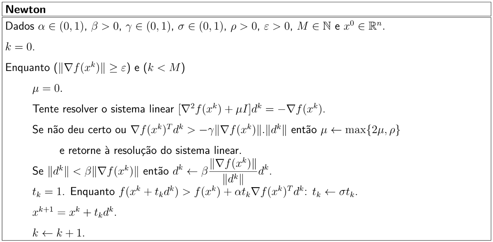
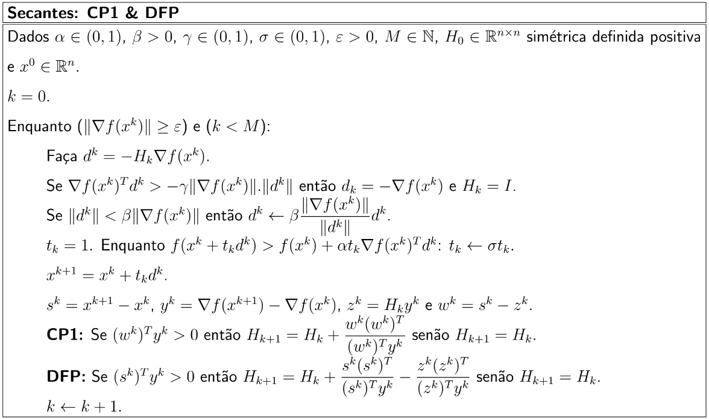

# MS629-Unrestricted-Optimization

Códigos elaborados por mim, referentes aos métodos ensinados na disciplina MS629 - Programação Não-Linear, da UNICAMP, no 2° semestre de 2023.

No repositório, encontram-se os códigos dos projetos solicitados para avaliação da disciplina. Os métodos são implementados em Fortran.

## Configurações de Sistema

Os códigos foram desenvolvidos com as seguintes configurações:

- Fedora Linux 38 
- GNU Fortran (GCC) 13.2.1 20231011 (Red Hat 13.2.1-4)
- Fortran Package Manager (fpm) 0.9.0 alpha

## Métodos Implementados

Métodos Clássicos de Descida

- Método do Gradiente
- Método de Newton
- Métodos Secantes:
    - Correção de Posto 1 (CP1)
    - Davidon, Fletcher e Powell (DFP)

## Algoritmos

